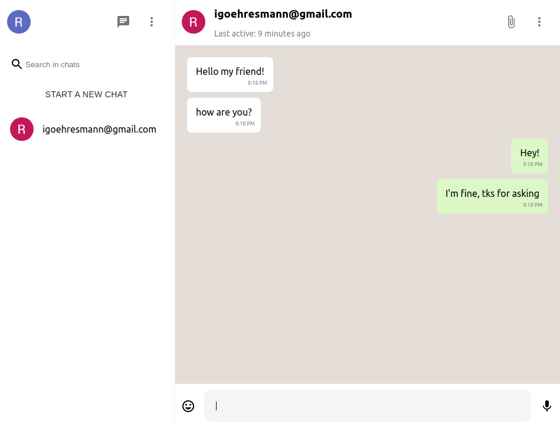

# Whatsapp Clone

Whatsapp clone is a limited implementation of Whatsapp (browser version) that comprehend the following features:

  * Registration, login and logout actions;
  * Possibility to add a user to chat with;
  * The chat feature itself.

Tools used in the development:

  * Nextjs;
  * Firebase.

This project has study purposes only.

## How to run this app?

In the project folder:

  * Run `yarn install`;
  * Configure you [Firebase](https://firebase.google.com/?hl=pt-br) project, including authentication and DB;
  * Create your `.env` based on `.env.example`, and fill it with your Firebase project settings;
  * Run `yarn dev`.
